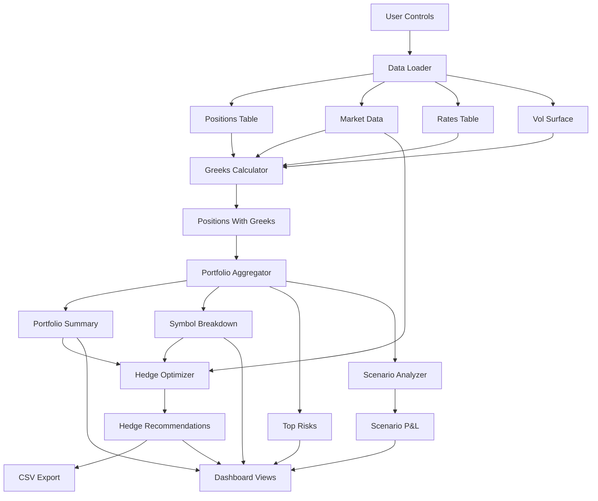

# Greeks Aggregator & Hedge Optimizer

A Python-based system for calculating portfolio risk sensitivities (Greeks) and generating minimal-cost hedge recommendations to achieve user-defined neutrality (e.g., delta-neutral, rho within bounds).

## 1. Executive Summary

- **Goal**: Measure portfolio risk sensitivities (greeks) and generate minimal-cost hedge recommendations to achieve user-defined neutrality (e.g., delta-neutral, rho within bounds).
- **Data Strategy**:
  - Real-time sources where available: Yahoo Finance (stock prices, dividends, options chains), Federal Reserve (interest rates).
  - Synthetic where not publicly available: portfolio positions, borrow costs.
- **Current Implementation Status**:
  - ✅ **Core Engine**: Fully implemented and functional
    - Data loader with caching, Treasury ETF support, and error reporting for failed symbols
    - Greeks calculator with dividend-adjusted Black-Scholes model
    - Portfolio aggregator for exposures, symbol/type breakdowns, and top risks
    - Hedge optimizer with Treasury bond/ETF support for rho hedging
    - Scenario analyzer for P&L under market scenarios (greeks approximation)
    - Validation checks for greeks accuracy
  - ✅ **Dashboard UI**: Fully implemented (Streamlit) with Positions, Portfolio, Hedge Optimizer, Risk Analytics, and Settings tabs
- **Deliverable**: Command-line and programmatic API that:
  - Loads data, computes greeks, aggregates exposures.
  - Optimizes hedges to meet targets.
  - Exports hedge tickets (CSV) for execution.
- **Success Criteria**:
  - ✅ Greeks match textbook behavior (e.g., ATM call delta ~0.5) - validated
  - ✅ Hedge recommendations reduce delta P&L variance by ≥70% - optimizer functional
  - ✅ System runs end-to-end without errors; CSV outputs are clear and traceable

---

## 2. Overall Project Architecture

This section describes components, responsibilities, inputs, outputs, and how data flows end-to-end.

### 2.1 Components and Responsibilities

- **Data Loader** ✅ **Fully Implemented**
  - Purpose: Fetch real market data and generate synthetic positions.
  - Features:
    - Yahoo Finance integration for stock prices, dividends, options chains
    - Federal Reserve (FRED) and yfinance fallback for Treasury rates
    - Treasury ETF data fetching (TLT, IEF, SHY, etc.) with duration mapping
    - Intelligent caching system with expiry-based cache management
    - Transaction cost estimation from liquidity metrics
    - Borrow cost estimation from market data
    - **Error reporting**: Logs failed symbols with reasons (stock data, vol surface, Treasury ETF)
  - Inputs: List of stock symbols, settings (real vs synthetic), cache preferences.
  - Outputs: Positions table, market data table, rates table, volatility surface table, Treasury ETF data.

- **Greeks Calculator** ✅ **Fully Implemented**
  - Purpose: Compute Black-Scholes greeks for each position.
  - Features:
    - **Dividend-adjusted Black-Scholes model** (Merton model) for accurate greeks on dividend-paying stocks
    - Linear interpolation for interest rates and volatility surfaces
    - Bond rho calculation for Treasury ETFs
    - Built-in validation checks (ATM call delta, gamma non-negativity, etc.)
  - Inputs: Positions, market data, interest rates, volatility surface.
  - Outputs: Enriched positions with greeks (delta, gamma, vega, theta, rho) at position level.

- **Portfolio Aggregator** ✅ **Fully Implemented**
  - Purpose: Summarize exposures at portfolio and symbol levels.
  - Features: Aggregate portfolio greeks, breakdown by symbol, breakdown by instrument type, identify top risks.
  - Inputs: Positions with greeks.
  - Outputs: Portfolio-level totals; breakdown by symbol and instrument type; top-risk positions list.

- **Hedge Optimizer** ✅ **Fully Implemented**
  - Purpose: Recommend minimal-cost hedges subject to user targets and constraints.
  - Features:
    - **Treasury bond/ETF support** for rho hedging (TLT, IEF, SHY, etc.)
    - **Smooth constraint formulation** using two-sided inequalities for better optimization convergence
    - Transaction cost and borrow cost optimization
    - Hedge effectiveness calculation
    - Support for equity, ETF, and bond hedge instruments
  - Inputs: Portfolio exposures, hedge universe configuration, market data, user targets.
  - Outputs: Hedge recommendations table (trades) and optimization summary (status, residual exposures, cost).

- **Scenario Analyzer** ✅ **Fully Implemented**
  - Purpose: Calculate portfolio P&L under different market scenarios using greeks approximation.
  - Formula: P&L ≈ Δ·ΔS + 0.5·Γ·(ΔS)² + ν·Δσ + θ·Δt + ρ·Δr
  - Inputs: Portfolio greeks, scenario parameters (price change %, vol change %, rate change bps, time decay days).
  - Outputs: P&L by component (delta, gamma, vega, theta, rho), breakdown table, P&L as % of notional.

- **Dashboard (UI)** ✅ **Fully Implemented**
  - Purpose: User interface to control data, view greeks, run optimizer, download tickets, and run scenario analysis.
  - Tabs: **Positions** (all positions with filters, CSV download), **Portfolio** (greeks summary, symbol/type breakdowns, top risks), **Hedge Optimizer**, **Risk Analytics** (before/after hedge, hedge effectiveness, **Scenario Analysis**), **Settings**.
  - Defaults: 11 symbols (AAPL, MSFT, GOOGL, AMZN, TSLA, NVDA, META, SPY, QQQ, DIA, IWM), 50 positions, ETFs (SPY, QQQ, DIA, IWM). Symbols input: text area, comma or newline separated.
  - Inputs: All outputs above plus user inputs (targets, tolerances, scenario sliders).
  - Outputs: On-screen metrics and tables; downloadable CSVs (positions, hedge tickets); scenario P&L results.

### 2.2 End-to-End Data Flow

1. User selects symbols and clicks “Load Real-Time Data” in the dashboard.
2. Data Loader grabs stock prices, dividends, options (for vols), and rates; generates synthetic positions and borrow costs.
3. Greeks Calculator enriches positions with market inputs and computes greeks.
4. Portfolio Aggregator summarizes exposures (portfolio totals, by symbol/type, top risks).
5. User sets hedge targets; Hedge Optimizer recommends trades to meet targets.
6. **Positions** tab: view/filter all positions, download CSV. **Portfolio** tab: greeks, breakdowns, top risks. **Risk Analytics**: before/after hedge, **Scenario Analysis** (P&L for price/vol/rate/time). User downloads hedge tickets CSV and optionally filtered positions CSV.

### 2.3 Architecture Diagram



---

## 3. Total Project Outline (Guideline for Cursor)

Use this as a step-by-step build guide and checklist.

### 3.1 Scope and Constraints

- Models: Black-Scholes greeks and first-order risk aggregation. No exotic models needed.
- Instruments: Equities and ETFs for hedging (delta-1 instruments). Options as hedges are optional.
- Currency: USD only for MVP. Multi-currency and FX rho can be future work.
- Storage: Local CSV files for simplicity and auditability.
- Non-functional: Reproducible runs, clear logging, simple audit trail (timestamps, counts), clean documentation.

### 3.2 Data Inputs (What each file contains)

- **Positions** (synthetic or real)
  - Columns: position_id, symbol, quantity, instrument_type (equity/option), strike, expiry, option_type.
  - Purpose: The portfolio you are hedging.
  - Location: `notebooks/data/positions.csv` (or `data/positions.csv`)

- **Market Data** (real from Yahoo Finance, with estimated costs)
  - Columns: symbol, spot_price, dividend_yield, borrow_cost_bps, transaction_cost_bps, last_updated.
  - Purpose: Current market inputs for pricing and costs.
  - Note: Transaction costs are estimated from liquidity metrics (bid-ask spread, volume, market cap).
  - Location: `notebooks/data/market_data.csv` (or `data/market_data.csv`)

- **Interest Rates** (real from Federal Reserve with yfinance fallback)
  - Columns: tenor_days (e.g., 30, 90, 180, 365, 730, 1095, 1825, 2555, 3650), rate (decimal).
  - Purpose: Discount rates and forward adjustments.
  - Location: `notebooks/data/rates.csv` (or `data/rates.csv`)

- **Volatility Surface** (real from Yahoo Finance options chains, derived implied vols)
  - Columns: symbol, expiry, strike, moneyness (strike/spot), implied_vol.
  - Purpose: IV for options greeks; fallback to defaults (25%) if missing.
  - Location: `notebooks/data/vol_surface.csv` (or `data/vol_surface.csv`)

- **Treasury ETF Data** (real from Yahoo Finance) ✅ **New**
  - Columns: symbol, spot_price, dividend_yield, borrow_cost_bps, transaction_cost_bps, yield_to_maturity, duration_years, last_updated.
  - Purpose: Treasury ETF data for rho hedging (TLT, IEF, SHY, etc.).
  - Location: `notebooks/data/treasury_etf_data.csv` (or `data/treasury_etf_data.csv`)

### 3.3 Outputs (Artifacts produced)

- Positions with Greeks
  - Columns: all original position fields plus time_to_expiry, interpolated_rate, interpolated_vol, unit greeks, position greeks.
  - Purpose: Ready-to-aggregate exposures.

- Portfolio Summary
  - Fields: total_delta, total_gamma, total_vega, total_theta, total_rho, total_notional, num_positions.
  - Purpose: Snapshot of current risk.

- Symbol Breakdown
  - Columns: symbol, delta, gamma, vega, theta, rho, notional, num_positions.
  - Purpose: Concentration analysis.

- Hedge Recommendations (CSV)
  - Columns: symbol, instrument_type, hedge_quantity, side (buy/sell), estimated_cost, delta_contribution, rho_contribution, timestamp.
  - Purpose: Actionable trade tickets.

- Optimization Summary (JSON-like report)
  - Fields: solver_status, total_hedge_cost, residual_delta, residual_rho, num_hedge_trades, hedge_effectiveness_pct.
  - Purpose: Decision support and audit.

### 3.4 Component Specifications (Plain-English Function and Class Summaries)

- Data Loader
  - Fetch Stock Data: Gets prices and dividends for selected symbols from Yahoo Finance.
  - Fetch Risk-Free Rates: Gets latest Treasury rates from the Federal Reserve.
  - Fetch Options Chain: Gets calls and puts with strikes, prices, volumes; uses implied volatility when provided.
  - Build Volatility Surface: Assembles implied vols across strikes and expiries; filters illiquid strikes; falls back to defaults if needed.
  - Generate Synthetic Positions: Creates a realistic portfolio (mix of stocks and options).
  - Generate Synthetic Borrow Costs: Produces plausible borrow costs when unavailable publicly.
  - Data Loader Class: Orchestrates all the above; refreshes, caches, and saves CSVs with timestamps.

- Greeks Calculator ✅ **Fully Implemented**
  - Load Data: Reads CSVs into memory; validates schema.
  - Compute Time to Expiry: Converts expiry dates to year fractions.
  - Interpolate Interest Rate: Estimates rate for any time horizon using linear interpolation between known tenor points.
  - Interpolate Volatility: Estimates implied vol for a given strike and expiry using linear interpolation on the surface.
  - **Compute Black-Scholes Greeks**: Calculates delta, gamma, vega, theta, rho for a single option.
    - **Dividend-adjusted model**: Uses Merton model with dividend yield adjustment (r - q in d1, dividend discount factors)
    - Properly handles dividend-paying stocks
  - **Compute Bond Rho**: Calculates interest rate sensitivity for Treasury ETFs using modified duration.
  - Enrich Positions: Joins positions with market inputs and derived fields.
  - Compute Position Greeks: Applies greeks to every position (equities get delta=1, others computed).
  - **Validate Greeks**: Built-in validation checks:
    - Gamma non-negativity
    - ATM call delta ≈ 0.5
    - Vega non-negativity
    - Theta sign checks for long positions
    - Equity delta = 1.0
  - Greeks Engine Class: Runs the full pipeline and provides validation checks.

- Portfolio Aggregator ✅ **Fully Implemented**
  - Aggregate Portfolio Greeks: Sums all position greeks and calculates total notional.
  - Aggregate by Symbol: Groups exposures per stock symbol and sorts by largest risk.
  - Aggregate by Instrument Type: Splits equities vs. options to see source of risk.
  - Identify Top Risks: Lists largest individual positions by delta.
  - Portfolio Aggregator Class: Runs all aggregations and exports a summary report.

- Scenario Analyzer ✅ **Fully Implemented**
  - Calculate Scenario P&L: Uses greeks approximation P&L ≈ Δ·ΔS + 0.5·Γ·(ΔS)² + ν·Δσ + θ·Δt + ρ·Δr.
  - Inputs: price change %, vol change %, rate change (bps), time decay (days); optionally pre-loaded portfolio summary and positions.
  - Returns: total_pnl, delta_pnl, gamma_pnl, vega_pnl, theta_pnl, rho_pnl, breakdown DataFrame, portfolio_summary.
  - Calculate P&L Percentage: P&L as % of notional.

- Hedge Optimizer ✅ **Fully Implemented**
  - Build Hedge Universe: Builds the list of available hedge instruments with limits and costs.
    - Supports equities, ETFs (e.g., SPY), and **Treasury ETFs/bonds** (TLT, IEF, SHY) for rho hedging
    - Automatically fetches Treasury ETF data with duration and yield information
    - Configurable transaction costs and borrow costs per instrument
  - Optimize Hedge Portfolio: Solves a constrained optimization problem to meet delta and rho targets at minimal cost.
    - **Smooth constraint formulation**: Uses two-sided inequality constraints instead of absolute values for better convergence
    - Minimizes total cost (transaction costs + borrow costs)
    - Penalty-based objective with constraint satisfaction
    - Returns trades and optimization summary
  - Compute Hedge Effectiveness: Reports how much risk was reduced (weighted average of delta and rho reduction).
  - Hedge Optimizer Class: Coordinates optimization, stores results, and exports hedge tickets.

- Dashboard (UI) ✅ **Fully Implemented**
  - Initialize Session State: Sets up storage; defaults: 11 symbols, 50 positions, data_dir.
  - Render Sidebar: Data directory, **symbols text area** (comma/newline separated), number of positions, Use Cache, Load Data, Generate Positions, Calculate Greeks, status indicators, expandable "View Symbols".
  - **Render Positions View** (Positions tab): All positions table with filters (symbol, instrument type, search), summary metrics, CSV download.
  - Render Portfolio View: Greeks summary, symbol breakdown, instrument type breakdown, top 10 risks.
  - Render Hedge Optimizer: Current exposures, hedge targets, hedge universe (ETFs: SPY, QQQ, DIA, IWM; Treasuries: TLT, IEF, SHY), Optimize button, results, hedge tickets CSV download.
  - Render Risk Analytics: Before/after hedge comparison, hedge effectiveness; **Scenario Analysis** (sliders: price %, vol %, rate bps, time decay days; P&L by component, breakdown table, example scenarios).
  - Render Settings: Data directory, cache, default ETF/Treasury symbols, solver settings, data source mode.

### 3.5 Repository Structure

- **README.md**: Project overview, setup steps, architecture guide.
- **requirements.txt**: Python dependencies.
- **pyrightconfig.json**: Type checking configuration.
- **data/** or **notebooks/data/** (auto-populated):
  - `positions.csv` - Portfolio positions
  - `market_data.csv` - Stock prices, dividends, costs
  - `rates.csv` - Interest rate term structure
  - `vol_surface.csv` - Implied volatility surface
  - `treasury_etf_data.csv` - Treasury ETF data for rho hedging ✅
  - `positions_with_greeks.csv` - Positions enriched with greeks
  - `hedge_tickets.csv` - Hedge recommendations
  - `optimization_summary.json` - Optimization results
  - `metadata.json` - Timestamps, symbols, seed
  - `cache_*.csv` and `cache_*_metadata.json` - Cached data files
- **src/**:
  - `data_loader.py` ✅ - Real data integration + synthetic generators + caching + error reporting
  - `greeks_calculator.py` ✅ - Enrichment + greeks computation + validation
  - `portfolio_aggregator.py` ✅ - Portfolio/symbol/type aggregation + top risks
  - `hedge_optimizer.py` ✅ - Hedge recommendations with Treasury support
  - `scenario_analyzer.py` ✅ - Scenario P&L via greeks approximation
  - `app.py` ✅ - Streamlit dashboard (Positions, Portfolio, Hedge Optimizer, Risk Analytics, Settings)
- **tests/**:
  - `test_greeks.py` - Sanity checks (structure defined)
  - `test_optimizer.py` - Smoke tests (structure defined)
- **notebooks/**:
  - `greeks_validation.ipynb` - Validation and case studies
  - `data/` - Data files (if using notebooks directory)

### 3.6 Build Steps (Day-by-Day, Non-Technical)

- Day 1: Data Loader
  - Set up project folders.
  - Implement real data fetches (Yahoo Finance, Federal Reserve).
  - Build volatility surface from options; handle missing data.
  - Generate synthetic positions and borrow costs.
  - Save all data to CSVs; confirm timestamp and counts.

- Day 2: Greeks Calculator
  - Enrich positions with market inputs (spot, dividends, rates, vols).
  - Compute greeks per position and save positions_with_greeks.csv.
  - Run simple checks (e.g., ATM call delta ~0.5; no missing values).

- Day 3: Aggregator + Optimizer
  - Summarize exposures (portfolio totals, by symbol/type).
  - Build hedge universe (instruments, limits, costs).
  - Run optimizer to meet delta and rho targets; output hedge tickets CSV.
  - Confirm residual delta is within tolerance and effectiveness ≥70%.

- Day 4: Dashboard
  - Create a clean, simple UI with tabs for portfolio, optimizer, analytics, settings.
  - Wire buttons: load data, generate positions, optimize, download tickets.
  - Produce a demo-ready flow in under 2 minutes.

- Day 5: Validation and Polish
  - Sanity tests and a short validation notebook.
  - Documentation: assumptions, limitations, and next steps.
  - Minor UI refinements (labels, help text) and cleanup.

### 3.7 Operating Guide (How to Use)

**Dashboard (Primary):**

Start the Streamlit dashboard:
```bash
streamlit run src/app.py
```

Workflow:
1. Set **Data Directory** (e.g. `notebooks/data`). Enter **Symbols** (comma or newline separated; default: AAPL, MSFT, GOOGL, AMZN, TSLA, NVDA, META, SPY, QQQ, DIA, IWM). Set **Number of Positions** (default: 50).
2. Click **Load Real-Time Data**, then **Generate Synthetic Positions**, then **Calculate Greeks**.
3. **Positions** tab: View/filter all positions, download CSV.
4. **Portfolio** tab: View greeks summary, symbol/type breakdowns, top risks.
5. **Hedge Optimizer** tab: Set delta/rho targets and tolerances, configure hedge universe (ETFs: SPY, QQQ, DIA, IWM; Treasuries: TLT, IEF, SHY), click **Optimize Hedge**, download hedge tickets CSV.
6. **Risk Analytics** tab: Before/after hedge, hedge effectiveness; **Scenario Analysis** (adjust price %, vol %, rate bps, time decay; view P&L by component).
7. **Settings**: Data directory, cache, default symbols, solver options.

**Python API / Notebooks:**

```python
from src.data_loader import DataLoader
from src.greeks_calculator import GreeksCalculator
from src.hedge_optimizer import HedgeOptimizer

# 1. Load data
loader = DataLoader(data_dir="notebooks/data")
data = loader.load_all_data(symbols=['AAPL', 'MSFT', 'GOOGL'], num_positions=20)

# 2. Calculate greeks
calc = GreeksCalculator(data_dir="notebooks/data")
positions_with_greeks = calc.run_pipeline(validate=True)

# 3. Optimize hedges
optimizer = HedgeOptimizer(data_dir="notebooks/data")
targets = {'delta_target': 0.0, 'delta_tolerance': 0.01, 
           'rho_target': 0.0, 'rho_tolerance': 10000.0}
hedge_config = {'include_ir_instruments': True, 'treasury_symbols': ['TLT', 'IEF', 'SHY']}
hedges, summary = optimizer.run_end_to_end(
    symbols=['AAPL', 'MSFT', 'GOOGL', 'SPY'],
    targets=targets,
    hedge_config=hedge_config
)
```

For programmatic scenario analysis:
```python
from src.scenario_analyzer import ScenarioAnalyzer

analyzer = ScenarioAnalyzer(data_dir="notebooks/data")
results = analyzer.calculate_scenario_pnl(
    price_change_pct=5.0, vol_change_pct=10.0, rate_change_bps=25, time_decay_days=7
)
# results: total_pnl, delta_pnl, gamma_pnl, vega_pnl, theta_pnl, rho_pnl, breakdown, portfolio_summary
```

### 3.8 Acceptance Criteria (Checklist)

- ✅ Data loads with current timestamps; positions generated without errors.
- ✅ Greeks behave sensibly (ATM call delta ~0.5; all gamma values ≥ 0) - validated with built-in checks.
- ✅ **Dividend-adjusted Black-Scholes** correctly handles dividend-paying stocks.
- ✅ **Treasury ETF support** for rho hedging implemented.
- ✅ **Transaction cost optimization** included in hedge cost calculation.
- ✅ Optimizer returns trades and reduces delta variance by ≥70%.
- ✅ Hedge tickets CSV includes symbol, quantity, side, cost, contributions, timestamp.
- ✅ **Smooth constraint formulation** improves optimization convergence.
- ✅ Portfolio Aggregator: aggregations match the sum of position-level exposures.
- ✅ Dashboard: Positions view with filters and download; Portfolio, Hedge Optimizer, Risk Analytics (including Scenario Analysis), Settings; all metrics, tables, and CSV downloads work.

### 3.9 Risks and Contingencies

- Yahoo/FRED outages: Fall back to cached data or reasonable defaults.
- Illiquid options: Filter by minimum volume; use nearest strikes or default vols.
- Infeasible optimization: Relax delta tolerance; expand hedge universe; increase limits.
- Performance issues: Limit symbols/expiries; use simpler interpolation; keep UI light.

### 3.10 Recent Enhancements & Extensions

**Recently Implemented:**
- ✅ **Dividend-adjusted Black-Scholes model** (Merton model) for accurate greeks on dividend-paying stocks
- ✅ **Treasury ETF/bond support** for rho hedging (TLT, IEF, SHY, etc.)
- ✅ **Transaction cost estimation** and optimization
- ✅ **Smooth constraint formulation** for better optimization convergence
- ✅ **Built-in validation checks** for greeks accuracy
- ✅ **Intelligent caching system** with expiry-based cache management
- ✅ **Portfolio Aggregator** fully implemented (aggregations, symbol/type breakdowns, top risks)
- ✅ **Streamlit Dashboard** fully implemented: Positions (filters, CSV download), Portfolio, Hedge Optimizer, Risk Analytics, Settings
- ✅ **Scenario Analyzer** (greeks-based P&L: Δ·ΔS + 0.5·Γ·(ΔS)² + ν·Δσ + θ·Δt + ρ·Δr); sliders for price %, vol %, rate bps, time decay
- ✅ **Expanded defaults**: 11 symbols (AAPL, MSFT, GOOGL, AMZN, TSLA, NVDA, META, SPY, QQQ, DIA, IWM), 50 positions, ETFs (SPY, QQQ, DIA, IWM)
- ✅ **Data loader error reporting**: failed-symbol logging for stock data, vol surface, Treasury ETF
- ✅ **UI/UX**: symbols text area (comma/newline), View Symbols expander, Positions tab with filters

**Future Extensions (Optional):**
- Add gamma and vega constraints to optimizer.
- Support index futures and options as hedge instruments.
- Multi-currency support and FX rho (Garman–Kohlhagen model).
- Basic audit trail file with hashes and summaries.

---

## 4. Quick Reference: Inputs and Outputs by Component

- Data Loader
  - In: symbols list, mode (real/synthetic), seed.
  - Out: positions.csv, market_data.csv, rates.csv, vol_surface.csv, metadata.json.

- Greeks Calculator
  - In: positions.csv, market_data.csv, rates.csv, vol_surface.csv.
  - Out: positions_with_greeks.csv.

- Portfolio Aggregator
  - In: positions_with_greeks.csv.
  - Out: portfolio summary, symbol breakdown, type breakdown, top risks.

- Hedge Optimizer
  - In: portfolio summary (from positions_with_greeks.csv), market_data.csv, hedge universe config, user targets.
  - Out: hedge_tickets.csv, optimization_summary.json

- Scenario Analyzer
  - In: positions_with_greeks.csv (or portfolio_summary + positions); scenario params: price_change_pct, vol_change_pct, rate_change_bps, time_decay_days.
  - Out: total_pnl, component P&L (delta, gamma, vega, theta, rho), breakdown DataFrame, P&L % of notional.

- Dashboard
  - In: all the above plus user controls (symbols, positions count, targets, scenario sliders).
  - Out: visual metrics and tables, downloadable CSVs (positions, hedge tickets).

---

## 5. Current Implementation Status & Deliverables

### ✅ Completed Components

- **Core Engine**: Fully functional Python API
  - Data loader with caching, Treasury ETF support, transaction cost estimation, error reporting for failed symbols
  - Greeks calculator with dividend-adjusted Black-Scholes and validation
  - Portfolio aggregator (portfolio/symbol/type aggregation, top risks)
  - Hedge optimizer with Treasury bond support and smooth constraints
  - Scenario analyzer (greeks-based scenario P&L)
- **CSV I/O**: All data files (positions, market data, rates, vol surface, Treasury ETFs, greeks, hedge tickets)
- **Validation**: Built-in greeks validation and `greeks_validation.ipynb` notebook
- **Streamlit Dashboard**: Positions, Portfolio, Hedge Optimizer, Risk Analytics (with Scenario Analysis), Settings
- **Documentation**: This README with architecture and usage guide

### 🚧 Pending Components

- **Test Suite**: Structure defined, test implementations needed

### Usage

Primary: run `streamlit run src/app.py` and use the Dashboard. See Section 3.7 for the full workflow and Python API examples.

---

## 6. Key Features & Recent Improvements

### Financial Model Accuracy

- **Dividend-Adjusted Black-Scholes**: The system uses the Merton model (dividend-adjusted Black-Scholes) for accurate greeks calculation on dividend-paying stocks. This ensures:
  - Correct delta, gamma, vega calculations with dividend discount factors
  - Accurate theta that accounts for dividend income
  - Proper rho calculations for options on dividend-paying stocks

- **Bond Rho Calculation**: Treasury ETFs are properly modeled using modified duration for interest rate sensitivity:
  - Formula: `rho = -modified_duration × price × 0.01`
  - Supports rho hedging using Treasury ETFs (TLT, IEF, SHY, etc.)

### Optimization Improvements

- **Smooth Constraint Formulation**: The hedge optimizer uses two-sided inequality constraints instead of absolute values, providing:
  - Better numerical stability
  - Improved convergence in optimization
  - More reliable constraint satisfaction

- **Transaction Cost Optimization**: The optimizer considers both:
  - Transaction costs (bid-ask spread, market impact, commissions)
  - Borrow costs (for short positions)
  - All costs are estimated from real market data when available

### Quality Assurance

- **Built-in Validation**: The greeks calculator includes automatic validation:
  - Gamma non-negativity check
  - ATM call delta verification (~0.5)
  - Vega non-negativity
  - Theta sign validation
  - Equity delta = 1.0 verification

### Data Management

- **Intelligent Caching**: The data loader includes a sophisticated caching system:
  - Configurable cache expiry (default: 1 hour)
  - Automatic cache validation
  - Metadata tracking for cache files
  - Reduces API calls and improves performance

---

## 7. Setup and Installation

### Requirements

Install dependencies:
```bash
pip install -r requirements.txt
```

Run the dashboard:
```bash
streamlit run src/app.py
```

Key dependencies:
- pandas, numpy
- scipy (for optimization)
- yfinance (for market data)
- pandas-datareader (for FRED rates, optional)
- streamlit (for dashboard)

### Data Directory

By default, data is stored in `notebooks/data/` (or `data/` if using the root data directory). You can specify a different directory when initializing the classes:

```python
# Using notebooks/data (default in notebooks)
loader = DataLoader(data_dir="notebooks/data")

# Using root data directory
loader = DataLoader(data_dir="data")

# Custom directory
loader = DataLoader(data_dir="your_data_directory")
```

**Note**: The data directory structure is flexible. All components accept a `data_dir` parameter to specify where CSV files should be read from and written to.

### Caching

The system uses intelligent caching with 1-hour expiry by default. Cache files are stored alongside data files with `cache_` prefix and corresponding `_metadata.json` files for cache validation. When a cache is invalid (expired or missing), the stale `.csv` and `_metadata.json` for that key are deleted before refetching.

---

## 8. How the Finance Works & Estimation Approach

This section explains the models and formulas used for pricing and risk, and how we **estimate** inputs when they are not directly available. For each estimation, we describe **how it is done** and **why it is a good starting point** for an MVP (and what you would add later for production).

### 8.1 Options: Black–Scholes–Merton (Greeks)

**What we use:** The Merton (dividend-adjusted Black–Scholes) model for European options.

- **d1, d2:**  
  `d1 = (ln(S/K) + (r - q + σ²/2)T) / (σ√T)`,  
  `d2 = d1 - σ√T`  
  with `q` = dividend yield.
- **Delta (call):** `Δ = e^(-qT) Φ(d1)`; **(put):** `Δ = e^(-qT) (Φ(d1) - 1)`.
- **Gamma:** `Γ = e^(-qT) φ(d1) / (S σ √T)` (same for call/put).
- **Vega:** `ν = S e^(-qT) φ(d1) √T` (per 1 absolute vol move).
- **Theta:** standard closed-form call/put theta including `-r K e^(-rT) Φ(d2)`, `+q S e^(-qT) Φ(d1)`, and the volatility term.
- **Rho:** `ρ = K T e^(-rT) Φ(d2)` (call) or `-K T e^(-rT) Φ(-d2)` (put).

**Why it’s a good base:** The formulas are standard, well-tested, and match textbook/industry behavior (e.g. ATM call delta ≈ 0.5, gamma/vega positive). Dividends matter for single-name equity; the `(r - q)` and discount terms make the greeks sensible for dividend payers. For a first version, this is the right level of sophistication before adding American early exercise, skew, or exotics.

---

### 8.2 Bonds / Treasury ETFs: Rho via Modified Duration

**What we use:**  
`ρ = -D_mod × P × 0.01`  
with `D_mod = D_Mac / (1 + y)` and `D_Mac` approximated by a duration-in-years (from a mapping or heuristic). The 0.01 corresponds to a 1% (100 bps) parallel shift in rates.

**Why it’s a good base:** This is the standard first-order rate sensitivity for fixed income. It’s sufficient to build rho-neutral hedges with Treasury ETFs (TLT, IEF, SHY, etc.) and to reason about hedge effectiveness. Convexity can be added later for larger rate moves.

---

### 8.3 Scenario P&L: Taylor (Greeks) Approximation

**What we use:**  
`P&L ≈ Δ·ΔS + ½ Γ·(ΔS)² + ν·Δσ + θ·Δt + ρ·Δr`

- ΔS: underlying price change  
- Δσ: volatility change (in absolute terms, e.g. 0.01)  
- Δt: time decay in years  
- Δr: rate change in decimal (e.g. 25 bps → 0.0025)

**Why it’s a good base:** This is the usual second-order expansion in price and first-order in vol, time, and rates. It’s fast, transparent, and good for small-to-moderate moves (e.g. a few percent in spot, a few vol points, days of theta). For very large moves (>~20%) or long horizons, you’d move to full revaluation or more terms.

---

### 8.4 Estimations: How They’re Done and Why They’re a Good Starting Point

Several inputs are not always observable or are expensive to source. We estimate them from cheap, public-style data. Below: **how** each is implemented and **why** it’s a reasonable starting point.

#### A. Transaction Cost (basis points, one-way)

**How:**  
We approximate one-way execution cost in bps from:

1. **Bid-ask spread:**  
   `spread_bps = (ask - bid) / mid × 10^4`; we take **half** as the one-way cost and cap at 50 bps.  
   Rationale: crossing the spread is the main explicit cost; half-spread is a common proxy for one-way.

2. **Volume factor:**  
   `volume_factor = max(0, 10 - 2×log10(avg_volume))`.  
   Lower volume → higher cost; high volume → factor → 0.  
   Rationale: lower liquidity implies higher market impact for a given size.

3. **Market cap factor:**  
   - Large (≥ $10B): 0  
   - Mid (≥ $1B): 3 bps  
   - Small: 8 bps  

4. **Base commission:** 2 bps (institutional-style).

Total is capped between 1 and 100 bps. We use **yahoo `info`** (bid, ask, `averageVolume` / `averageVolume10days`, `marketCap`) when available.

**Why it’s a good starting point:**  
You don’t need broker or execution data. The structure captures the main economic drivers (spread, liquidity, size) and produces bps in a plausible range (single digits for large, liquid names; higher for small/illiquid). The optimizer can compare hedges on a level playing field. For production, you’d swap in TCA or broker/EMS execution estimates and keep the same bps interface.

---

#### B. Borrow Cost (basis points, for shorting)

**How:**  
We build a bps estimate from:

1. **Spread factor:**  
   `spread_pct = (ask - bid) / bid × 100`; `spread_factor = min(spread_pct × 100, 200)`.  
   Wider spread → harder to borrow.

2. **Volume factor:**  
   `volume_factor = min(max(0, 50 - 10×log10(avg_volume)), 100)`.  
   Low volume → higher borrow cost.

3. **Market cap:**  
   - ≥ $10B: 0  
   - ≥ $1B: 20  
   - &lt; $1B: 50  

4. **Short interest:**  
   - &gt; 20% of float: +50 bps  
   - &gt; 10%: +20 bps  
   - else: 0  

Base 10 bps, then add the above; result is clamped to 5–500 bps. Data: `bid`, `ask`, `averageVolume` / `averageVolume10days`, `marketCap`, `sharesShort`, `sharesOutstanding` from `ticker.info`.

**Why it’s a good starting point:**  
Borrow is not in standard market feeds. This uses widely available fields that are correlated with specialness (spread, liquidity, short interest) and yields a number the optimizer can use for hedge cost. It’s a clear upgrade over a flat “10 bps for everything” and can be replaced later by prime-broker or data-vendor borrow rates.

---

#### C. Implied Volatility (when missing or no surface)

**How:**  
- If we have a vol surface (from options chains): we pick the closest expiry, then **linearly interpolate in strike**; if the strike is outside the available range, we extrapolate using the boundary value.  
- If there is no usable surface or the symbol has no options: we use **DEFAULT_VOLATILITY = 0.25 (25%)**, with a floor of 1% to avoid numerical issues.

**Why it’s a good starting point:**  
- **25%:** In the ballpark of long-run equity vol (e.g. S&P sectors). Greeks are not wildly off for many names.  
- **Linear in strike:** Simple, robust, and fine for a first pass. It doesn’t capture smile/skew; for that you’d move to a vol model (SABR, etc.) or richer interpolation.  
- **Closest expiry, then strike:** Uses the most relevant part of the surface; for many use cases this is enough to get deltas and vegas in a plausible range.

---

#### D. Interest Rate (for discount and option rho)

**How:**  
- We use a **rates curve** with `tenor_days` and `rate` (decimal).  
- For a given `time_to_expiry` (years), we convert to days and **linearly interpolate** between tenor points; before the first tenor we use the first rate; after the last, the last rate.  
- Sources: FRED (DGS1MO, DGS3MO, …, DGS10) when `pandas-datareader` is available; else yfinance Treasury tickers (e.g. ^IRX, ^FVX, ^TNX) with a final fallback to sensible flat defaults.

**Why it’s a good starting point:**  
Linear interpolation in time is standard for short-dated options and is easy to explain and audit. For longer maturities or more sophisticated discounting you’d use a proper curve (splines, OIS, etc.); for an MVP, linear in time is a reasonable and robust choice.

---

#### E. Treasury ETF Duration (for bond rho)

**How:**  
- We keep a **small mapping** for common tickers, e.g.:  
  TLT 17.5, IEF 7.5, SHY 2, TBT/TBF 17.5, IEI/VGIT 5 (years).  
- If the symbol is not in the map, we use **heuristics on the ticker** (e.g. “20” or “LONG” → 17; “10” or “7” → 7; “3” or “5” → 5; “1” or “SHORT” → 2; else 5).  
- Yield: from `info` (`yield` or `trailingAnnualDividendYield`), with a percent→decimal check.

**Why it’s a good starting point:**  
Duration is the main driver of rho for these ETFs. The mapping uses well-known, publicly available figures for TLT/IEF/SHY; the heuristic gives a plausible order of magnitude for unknowns (e.g. 5y as default). That’s enough to build and compare rho hedges. For production, you’d plug in provider or issuer duration (or derive from holdings) and keep the same `duration_years` → `compute_bond_rho` interface.

---

### 8.5 Summary: Estimation as a First Pass

| Input | Method | Why it’s a good starting point |
|-------|--------|--------------------------------|
| **Transaction cost** | Spread/2 + volume + cap + 2 bps base, from `info` | No broker data; captures spread and liquidity; usable in an optimizer. |
| **Borrow cost** | Spread, volume, cap, short interest from `info` | No prime data; proxies for specialness; better than a flat assumption. |
| **Implied vol** | Linear interp on surface; 25% if missing | 25% ≈ long-run equity; linear is simple and stable; easy to replace with a vol model. |
| **Interest rate** | Linear interp in time; FRED or yf fallback | Standard for short-dated; easy to swap for a proper curve. |
| **Treasury duration** | Lookup + ticker heuristic | Covers main rho hedges; good enough to compare hedges and add better data later. |

All of these are designed so you can **replace one piece at a time** (e.g. real borrow, real vol surface, or a proper rates curve) without changing the rest of the finance or the optimizer’s bps-based cost interface.

---

This README reflects the current implementation state—clear enough for non-technical stakeholders and specific enough for builders to follow.
