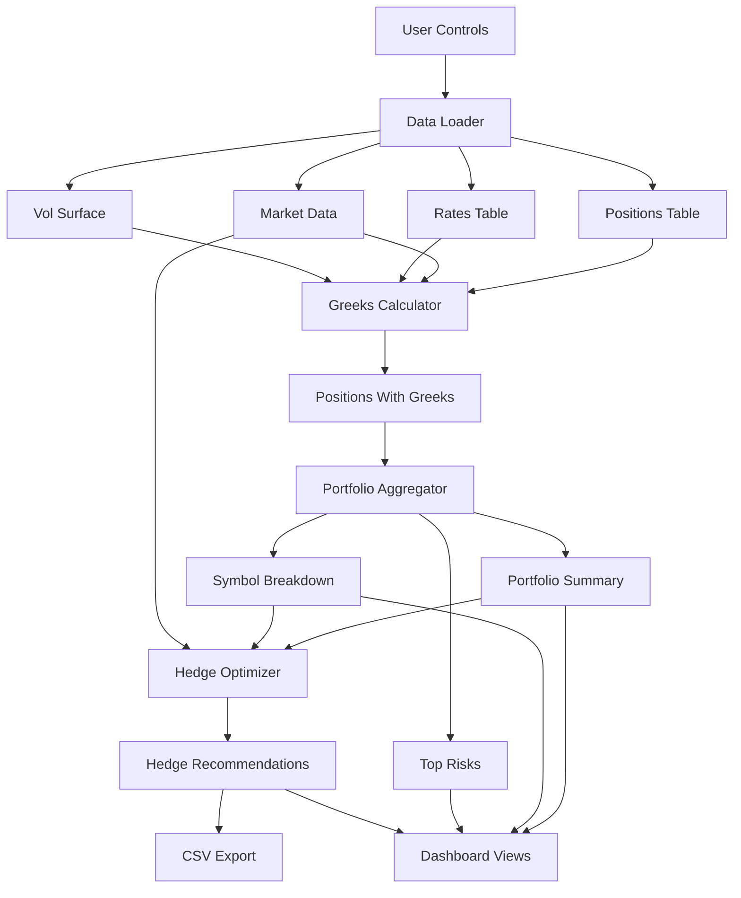

# Greeks Aggregator & Hedge Optimizer
Final Project Outline and Architecture Guide

This is a complete, non-technical blueprint you can give to a builder. It describes what to create, how the pieces fit, and what each part takes in and produces. It is written for a reader who is not a software engineer.

---

## 1. Executive Summary

- Goal: Measure portfolio risk sensitivities (greeks) and generate minimal-cost hedge recommendations to achieve user-defined neutrality (e.g., delta-neutral, rho within bounds).
- Data Strategy:
  - Real-time sources where available: Yahoo Finance (stock prices, dividends, options chains), Federal Reserve (interest rates).
  - Synthetic where not publicly available: portfolio positions, borrow costs.
- Deliverable: A dashboard that:
  - Loads data, computes greeks, aggregates exposures.
  - Optimizes hedges to meet targets.
  - Exports hedge tickets (CSV) for execution.
- Timeline: 5 days (35–40 hours).
- Success criteria:
  - Greeks match textbook behavior (e.g., ATM call delta ~0.5).
  - Hedge recommendations reduce delta P&L variance by ≥70%.
  - System runs end-to-end without errors; CSV outputs are clear and traceable.

---

## 2. Overall Project Architecture

This section describes components, responsibilities, inputs, outputs, and how data flows end-to-end.

### 2.1 Components and Responsibilities

- Data Loader
  - Purpose: Fetch real market data and generate synthetic positions.
  - Inputs: List of stock symbols, settings (real vs synthetic).
  - Outputs: Positions table, market data table, rates table, volatility surface table.

- Greeks Calculator
  - Purpose: Compute Black-Scholes greeks for each position.
  - Inputs: Positions, market data, interest rates, volatility surface.
  - Outputs: Enriched positions with greeks (delta, gamma, vega, theta, rho) at position level.

- Portfolio Aggregator
  - Purpose: Summarize exposures at portfolio and symbol levels.
  - Inputs: Positions with greeks.
  - Outputs: Portfolio-level totals; breakdown by symbol and instrument type; top-risk positions list.

- Hedge Optimizer
  - Purpose: Recommend minimal-cost hedges subject to user targets and constraints.
  - Inputs: Portfolio exposures, hedge universe configuration, market data, user targets.
  - Outputs: Hedge recommendations table (trades) and optimization summary (status, residual exposures, cost).

- Dashboard (UI)
  - Purpose: User interface to control data, view greeks, run optimizer, and download tickets.
  - Inputs: All outputs above plus user inputs (targets, tolerances).
  - Outputs: On-screen metrics and tables; downloadable CSV hedge tickets; simple reports.

### 2.2 End-to-End Data Flow

1. User selects symbols and clicks “Load Real-Time Data” in the dashboard.
2. Data Loader grabs stock prices, dividends, options (for vols), and rates; generates synthetic positions and borrow costs.
3. Greeks Calculator enriches positions with market inputs and computes greeks.
4. Portfolio Aggregator summarizes exposures (portfolio totals, by symbol/type, top risks).
5. User sets hedge targets; Hedge Optimizer recommends trades to meet targets.
6. Dashboard displays recommendations; user downloads hedge tickets CSV.

### 2.3 Architecture Diagram

---

## 3. Total Project Outline (Guideline for Cursor)

Use this as a step-by-step build guide and checklist.

### 3.1 Scope and Constraints

- Models: Black-Scholes greeks and first-order risk aggregation. No exotic models needed.
- Instruments: Equities and ETFs for hedging (delta-1 instruments). Options as hedges are optional.
- Currency: USD only for MVP. Multi-currency and FX rho can be future work.
- Storage: Local CSV files for simplicity and auditability.
- Non-functional: Reproducible runs, clear logging, simple audit trail (timestamps, counts), clean documentation.

### 3.2 Data Inputs (What each file contains)

- Positions (synthetic)
  - Columns: position_id, symbol, quantity, instrument_type (equity/option), strike, expiry, option_type.
  - Purpose: The portfolio you are hedging.

- Market Data (real from Yahoo Finance, plus synthetic borrow costs)
  - Columns: symbol, spot_price, dividend_yield, borrow_cost_bps, last_updated.
  - Purpose: Current market inputs for pricing and costs.

- Interest Rates (real from Federal Reserve)
  - Columns: tenor_days (e.g., 30, 90, 180, 365), rate (decimal).
  - Purpose: Discount rates and forward adjustments.

- Volatility Surface (real from Yahoo Finance options chains, derived implied vols)
  - Columns: symbol, expiry, strike, moneyness (strike/spot), implied_vol.
  - Purpose: IV for options greeks; fallback to defaults if missing.

### 3.3 Outputs (Artifacts produced)

- Positions with Greeks
  - Columns: all original position fields plus time_to_expiry, interpolated_rate, interpolated_vol, unit greeks, position greeks.
  - Purpose: Ready-to-aggregate exposures.

- Portfolio Summary
  - Fields: total_delta, total_gamma, total_vega, total_theta, total_rho, total_notional, num_positions.
  - Purpose: Snapshot of current risk.

- Symbol Breakdown
  - Columns: symbol, delta, gamma, vega, theta, rho, notional, num_positions.
  - Purpose: Concentration analysis.

- Hedge Recommendations (CSV)
  - Columns: symbol, instrument_type, hedge_quantity, side (buy/sell), estimated_cost, delta_contribution, rho_contribution, timestamp.
  - Purpose: Actionable trade tickets.

- Optimization Summary (JSON-like report)
  - Fields: solver_status, total_hedge_cost, residual_delta, residual_rho, num_hedge_trades, hedge_effectiveness_pct.
  - Purpose: Decision support and audit.

### 3.4 Component Specifications (Plain-English Function and Class Summaries)

- Data Loader
  - Fetch Stock Data: Gets prices and dividends for selected symbols from Yahoo Finance.
  - Fetch Risk-Free Rates: Gets latest Treasury rates from the Federal Reserve.
  - Fetch Options Chain: Gets calls and puts with strikes, prices, volumes; uses implied volatility when provided.
  - Build Volatility Surface: Assembles implied vols across strikes and expiries; filters illiquid strikes; falls back to defaults if needed.
  - Generate Synthetic Positions: Creates a realistic portfolio (mix of stocks and options).
  - Generate Synthetic Borrow Costs: Produces plausible borrow costs when unavailable publicly.
  - Data Loader Class: Orchestrates all the above; refreshes, caches, and saves CSVs with timestamps.

- Greeks Calculator
  - Load Data: Reads CSVs into memory; validates schema.
  - Compute Time to Expiry: Converts expiry dates to year fractions.
  - Interpolate Interest Rate: Estimates rate for any time horizon using known tenor points.
  - Interpolate Volatility: Estimates implied vol for a given strike and expiry using the surface.
  - Compute Black-Scholes Greeks: Calculates delta, gamma, vega, theta, rho for a single option.
  - Enrich Positions: Joins positions with market inputs and derived fields.
  - Compute Position Greeks: Applies greeks to every position (equities get delta=1, others 0).
  - Greeks Engine Class: Runs the full pipeline and provides basic validation checks.

- Portfolio Aggregator
  - Aggregate Portfolio Greeks: Sums all position greeks and calculates total notional.
  - Aggregate by Symbol: Groups exposures per stock symbol and sorts by largest risk.
  - Aggregate by Instrument Type: Splits equities vs. options to see source of risk.
  - Identify Top Risks: Lists largest individual positions by delta.
  - Portfolio Aggregator Class: Runs all aggregations and exports a summary report.

- Hedge Optimizer
  - Build Hedge Universe: Builds the list of available hedge instruments with limits and costs (e.g., AAPL, MSFT, SPY).
  - Optimize Hedge Portfolio: Solves a constrained problem to meet delta and rho targets at minimal cost; returns trades and a summary.
  - Compute Hedge Effectiveness: Reports how much risk was reduced (e.g., 99% delta variance reduction).
  - Hedge Optimizer Class: Coordinates optimization, stores results, and exports hedge tickets.

- Dashboard (UI)
  - Initialize Session State: Sets up storage so data persists while clicking around.
  - Render Sidebar: Controls for loading data, generating positions, and refreshing.
  - Render Portfolio View: Shows greeks summary, breakdowns, and top risks visually.
  - Render Hedge Optimizer: Accepts targets, runs optimization, shows trades, and offers CSV download.
  - Render Risk Analytics: Compares before/after hedge exposures and simple scenario analysis.
  - Render Settings: Edits hedge universe, solver settings, and data source mode (real vs synthetic).

### 3.5 Repository Structure (Plain-English)

- README: Project overview, setup steps, how to run the dashboard.
- data/ (auto-populated)
  - positions.csv, market_data.csv, rates.csv, vol_surface.csv
  - positions_with_greeks.csv, hedge_tickets.csv
  - metadata.json (timestamps, symbols, seed)
- src/
  - data_loader.py (real data integration + synthetic generators)
  - greeks_calculator.py (enrichment + greeks computation)
  - portfolio_aggregator.py (summaries and breakdowns)
  - hedge_optimizer.py (hedge recommendations)
  - app.py (dashboard)
- tests/ (optional for MVP)
  - test_greeks.py (sanity checks)
  - test_optimizer.py (smoke tests)
- notebooks/
  - greeks_validation.ipynb (optional validation and case studies)

### 3.6 Build Steps (Day-by-Day, Non-Technical)

- Day 1: Data Loader
  - Set up project folders.
  - Implement real data fetches (Yahoo Finance, Federal Reserve).
  - Build volatility surface from options; handle missing data.
  - Generate synthetic positions and borrow costs.
  - Save all data to CSVs; confirm timestamp and counts.

- Day 2: Greeks Calculator
  - Enrich positions with market inputs (spot, dividends, rates, vols).
  - Compute greeks per position and save positions_with_greeks.csv.
  - Run simple checks (e.g., ATM call delta ~0.5; no missing values).

- Day 3: Aggregator + Optimizer
  - Summarize exposures (portfolio totals, by symbol/type).
  - Build hedge universe (instruments, limits, costs).
  - Run optimizer to meet delta and rho targets; output hedge tickets CSV.
  - Confirm residual delta is within tolerance and effectiveness ≥70%.

- Day 4: Dashboard
  - Create a clean, simple UI with tabs for portfolio, optimizer, analytics, settings.
  - Wire buttons: load data, generate positions, optimize, download tickets.
  - Produce a demo-ready flow in under 2 minutes.

- Day 5: Validation and Polish
  - Sanity tests and a short validation notebook.
  - Documentation: assumptions, limitations, and next steps.
  - Minor UI refinements (labels, help text) and cleanup.

### 3.7 Operating Guide (How to Use)

- Start the dashboard.
- Choose symbols and click “Load Real-Time Data.”
- Click “Generate Synthetic Positions” (choose quantity).
- View “Portfolio Greeks” to inspect exposures.
- Go to “Hedge Optimizer,” set delta target (usually 0) and tolerance, then optimize.
- Review trades and click “Download Hedge Tickets CSV.”
- Optionally, use “Risk Analytics” to compare before/after hedge scenarios.
- Use “Settings” to adjust hedge universe and solver options.

### 3.8 Acceptance Criteria (Checklist)

- Data loads with current timestamps; positions generated without errors.
- Greeks behave sensibly (ATM call delta ~0.5; all gamma values ≥ 0).
- Aggregations match the sum of position-level exposures.
- Optimizer returns trades and reduces delta variance by ≥70%.
- Hedge tickets CSV includes symbol, quantity, side, cost, contributions, timestamp.
- Dashboard UX: clear metrics, tables render, download works.

### 3.9 Risks and Contingencies

- Yahoo/FRED outages: Fall back to cached data or reasonable defaults.
- Illiquid options: Filter by minimum volume; use nearest strikes or default vols.
- Infeasible optimization: Relax delta tolerance; expand hedge universe; increase limits.
- Performance issues: Limit symbols/expiries; use simpler interpolation; keep UI light.

### 3.10 Extensions (Optional)

- Add gamma and vega constraints to optimizer.
- Support index futures and options as hedge instruments.
- Multi-currency support and FX rho (Garman–Kohlhagen model).
- Basic audit trail file with hashes and summaries.

---

## 4. Quick Reference: Inputs and Outputs by Component

- Data Loader
  - In: symbols list, mode (real/synthetic), seed.
  - Out: positions.csv, market_data.csv, rates.csv, vol_surface.csv, metadata.json.

- Greeks Calculator
  - In: positions.csv, market_data.csv, rates.csv, vol_surface.csv.
  - Out: positions_with_greeks.csv.

- Portfolio Aggregator
  - In: positions_with_greeks.csv.
  - Out: portfolio summary, symbol breakdown, type breakdown, top risks.

- Hedge Optimizer
  - In: portfolio summary, market_data.csv, hedge universe config, user targets.
  - Out: hedge_tickets.csv, optimization_summary report.

- Dashboard
  - In: all the above plus user controls.
  - Out: visual metrics and tables, downloadable CSVs.

---

## 5. Final Deliverables

- Working dashboard that uses real market data where possible.
- CSV files for inputs/outputs (positions, market data, rates, vol surface, greeks, hedge tickets).
- A concise README explaining setup and usage.
- A short validation note or notebook showing greeks sanity and hedge effectiveness.

This outline is the complete guide for implementation and review—clear enough for non-technical stakeholders and specific enough for builders to follow.
