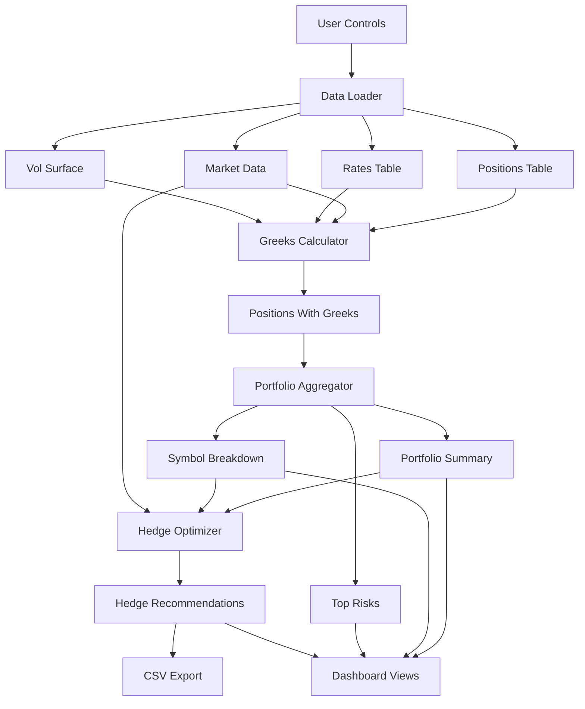

# Greeks Aggregator & Hedge Optimizer

A Python-based system for calculating portfolio risk sensitivities (Greeks) and generating minimal-cost hedge recommendations to achieve user-defined neutrality (e.g., delta-neutral, rho within bounds).

## 1. Executive Summary

- **Goal**: Measure portfolio risk sensitivities (greeks) and generate minimal-cost hedge recommendations to achieve user-defined neutrality (e.g., delta-neutral, rho within bounds).
- **Data Strategy**:
  - Real-time sources where available: Yahoo Finance (stock prices, dividends, options chains), Federal Reserve (interest rates).
  - Synthetic where not publicly available: portfolio positions, borrow costs.
- **Current Implementation Status**:
  - ✅ **Core Engine**: Fully implemented and functional
    - Data loader with caching and Treasury ETF support
    - Greeks calculator with dividend-adjusted Black-Scholes model
    - Hedge optimizer with Treasury bond/ETF support for rho hedging
    - Validation checks for greeks accuracy
  - 🚧 **Dashboard UI**: Skeleton implemented (Streamlit), needs completion
  - 🚧 **Portfolio Aggregator**: Structure defined, implementation pending
- **Deliverable**: Command-line and programmatic API that:
  - Loads data, computes greeks, aggregates exposures.
  - Optimizes hedges to meet targets.
  - Exports hedge tickets (CSV) for execution.
- **Success Criteria**:
  - ✅ Greeks match textbook behavior (e.g., ATM call delta ~0.5) - validated
  - ✅ Hedge recommendations reduce delta P&L variance by ≥70% - optimizer functional
  - ✅ System runs end-to-end without errors; CSV outputs are clear and traceable

---

## 2. Overall Project Architecture

This section describes components, responsibilities, inputs, outputs, and how data flows end-to-end.

### 2.1 Components and Responsibilities

- **Data Loader** ✅ **Fully Implemented**
  - Purpose: Fetch real market data and generate synthetic positions.
  - Features:
    - Yahoo Finance integration for stock prices, dividends, options chains
    - Federal Reserve (FRED) and yfinance fallback for Treasury rates
    - Treasury ETF data fetching (TLT, IEF, SHY, etc.) with duration mapping
    - Intelligent caching system with expiry-based cache management
    - Transaction cost estimation from liquidity metrics
    - Borrow cost estimation from market data
  - Inputs: List of stock symbols, settings (real vs synthetic), cache preferences.
  - Outputs: Positions table, market data table, rates table, volatility surface table, Treasury ETF data.

- **Greeks Calculator** ✅ **Fully Implemented**
  - Purpose: Compute Black-Scholes greeks for each position.
  - Features:
    - **Dividend-adjusted Black-Scholes model** (Merton model) for accurate greeks on dividend-paying stocks
    - Linear interpolation for interest rates and volatility surfaces
    - Bond rho calculation for Treasury ETFs
    - Built-in validation checks (ATM call delta, gamma non-negativity, etc.)
  - Inputs: Positions, market data, interest rates, volatility surface.
  - Outputs: Enriched positions with greeks (delta, gamma, vega, theta, rho) at position level.

- **Portfolio Aggregator** 🚧 **Structure Defined, Implementation Pending**
  - Purpose: Summarize exposures at portfolio and symbol levels.
  - Status: Class structure exists with method stubs; implementation needed.
  - Inputs: Positions with greeks.
  - Outputs: Portfolio-level totals; breakdown by symbol and instrument type; top-risk positions list.

- **Hedge Optimizer** ✅ **Fully Implemented**
  - Purpose: Recommend minimal-cost hedges subject to user targets and constraints.
  - Features:
    - **Treasury bond/ETF support** for rho hedging (TLT, IEF, SHY, etc.)
    - **Smooth constraint formulation** using two-sided inequalities for better optimization convergence
    - Transaction cost and borrow cost optimization
    - Hedge effectiveness calculation
    - Support for equity, ETF, and bond hedge instruments
  - Inputs: Portfolio exposures, hedge universe configuration, market data, user targets.
  - Outputs: Hedge recommendations table (trades) and optimization summary (status, residual exposures, cost).

- **Dashboard (UI)** 🚧 **Skeleton Implemented**
  - Purpose: User interface to control data, view greeks, run optimizer, and download tickets.
  - Status: Streamlit skeleton exists with placeholder functions; full implementation pending.
  - Current Usage: System is primarily used via Python API/notebooks
  - Inputs: All outputs above plus user inputs (targets, tolerances).
  - Outputs: On-screen metrics and tables; downloadable CSV hedge tickets; simple reports.

### 2.2 End-to-End Data Flow

1. User selects symbols and clicks “Load Real-Time Data” in the dashboard.
2. Data Loader grabs stock prices, dividends, options (for vols), and rates; generates synthetic positions and borrow costs.
3. Greeks Calculator enriches positions with market inputs and computes greeks.
4. Portfolio Aggregator summarizes exposures (portfolio totals, by symbol/type, top risks).
5. User sets hedge targets; Hedge Optimizer recommends trades to meet targets.
6. Dashboard displays recommendations; user downloads hedge tickets CSV.

### 2.3 Architecture Diagram



---

## 3. Total Project Outline (Guideline for Cursor)

Use this as a step-by-step build guide and checklist.

### 3.1 Scope and Constraints

- Models: Black-Scholes greeks and first-order risk aggregation. No exotic models needed.
- Instruments: Equities and ETFs for hedging (delta-1 instruments). Options as hedges are optional.
- Currency: USD only for MVP. Multi-currency and FX rho can be future work.
- Storage: Local CSV files for simplicity and auditability.
- Non-functional: Reproducible runs, clear logging, simple audit trail (timestamps, counts), clean documentation.

### 3.2 Data Inputs (What each file contains)

- **Positions** (synthetic or real)
  - Columns: position_id, symbol, quantity, instrument_type (equity/option), strike, expiry, option_type.
  - Purpose: The portfolio you are hedging.
  - Location: `notebooks/data/positions.csv` (or `data/positions.csv`)

- **Market Data** (real from Yahoo Finance, with estimated costs)
  - Columns: symbol, spot_price, dividend_yield, borrow_cost_bps, transaction_cost_bps, last_updated.
  - Purpose: Current market inputs for pricing and costs.
  - Note: Transaction costs are estimated from liquidity metrics (bid-ask spread, volume, market cap).
  - Location: `notebooks/data/market_data.csv` (or `data/market_data.csv`)

- **Interest Rates** (real from Federal Reserve with yfinance fallback)
  - Columns: tenor_days (e.g., 30, 90, 180, 365, 730, 1095, 1825, 2555, 3650), rate (decimal).
  - Purpose: Discount rates and forward adjustments.
  - Location: `notebooks/data/rates.csv` (or `data/rates.csv`)

- **Volatility Surface** (real from Yahoo Finance options chains, derived implied vols)
  - Columns: symbol, expiry, strike, moneyness (strike/spot), implied_vol.
  - Purpose: IV for options greeks; fallback to defaults (25%) if missing.
  - Location: `notebooks/data/vol_surface.csv` (or `data/vol_surface.csv`)

- **Treasury ETF Data** (real from Yahoo Finance) ✅ **New**
  - Columns: symbol, spot_price, dividend_yield, borrow_cost_bps, transaction_cost_bps, yield_to_maturity, duration_years, last_updated.
  - Purpose: Treasury ETF data for rho hedging (TLT, IEF, SHY, etc.).
  - Location: `notebooks/data/treasury_etf_data.csv` (or `data/treasury_etf_data.csv`)

### 3.3 Outputs (Artifacts produced)

- Positions with Greeks
  - Columns: all original position fields plus time_to_expiry, interpolated_rate, interpolated_vol, unit greeks, position greeks.
  - Purpose: Ready-to-aggregate exposures.

- Portfolio Summary
  - Fields: total_delta, total_gamma, total_vega, total_theta, total_rho, total_notional, num_positions.
  - Purpose: Snapshot of current risk.

- Symbol Breakdown
  - Columns: symbol, delta, gamma, vega, theta, rho, notional, num_positions.
  - Purpose: Concentration analysis.

- Hedge Recommendations (CSV)
  - Columns: symbol, instrument_type, hedge_quantity, side (buy/sell), estimated_cost, delta_contribution, rho_contribution, timestamp.
  - Purpose: Actionable trade tickets.

- Optimization Summary (JSON-like report)
  - Fields: solver_status, total_hedge_cost, residual_delta, residual_rho, num_hedge_trades, hedge_effectiveness_pct.
  - Purpose: Decision support and audit.

### 3.4 Component Specifications (Plain-English Function and Class Summaries)

- Data Loader
  - Fetch Stock Data: Gets prices and dividends for selected symbols from Yahoo Finance.
  - Fetch Risk-Free Rates: Gets latest Treasury rates from the Federal Reserve.
  - Fetch Options Chain: Gets calls and puts with strikes, prices, volumes; uses implied volatility when provided.
  - Build Volatility Surface: Assembles implied vols across strikes and expiries; filters illiquid strikes; falls back to defaults if needed.
  - Generate Synthetic Positions: Creates a realistic portfolio (mix of stocks and options).
  - Generate Synthetic Borrow Costs: Produces plausible borrow costs when unavailable publicly.
  - Data Loader Class: Orchestrates all the above; refreshes, caches, and saves CSVs with timestamps.

- Greeks Calculator ✅ **Fully Implemented**
  - Load Data: Reads CSVs into memory; validates schema.
  - Compute Time to Expiry: Converts expiry dates to year fractions.
  - Interpolate Interest Rate: Estimates rate for any time horizon using linear interpolation between known tenor points.
  - Interpolate Volatility: Estimates implied vol for a given strike and expiry using linear interpolation on the surface.
  - **Compute Black-Scholes Greeks**: Calculates delta, gamma, vega, theta, rho for a single option.
    - **Dividend-adjusted model**: Uses Merton model with dividend yield adjustment (r - q in d1, dividend discount factors)
    - Properly handles dividend-paying stocks
  - **Compute Bond Rho**: Calculates interest rate sensitivity for Treasury ETFs using modified duration.
  - Enrich Positions: Joins positions with market inputs and derived fields.
  - Compute Position Greeks: Applies greeks to every position (equities get delta=1, others computed).
  - **Validate Greeks**: Built-in validation checks:
    - Gamma non-negativity
    - ATM call delta ≈ 0.5
    - Vega non-negativity
    - Theta sign checks for long positions
    - Equity delta = 1.0
  - Greeks Engine Class: Runs the full pipeline and provides validation checks.

- Portfolio Aggregator
  - Aggregate Portfolio Greeks: Sums all position greeks and calculates total notional.
  - Aggregate by Symbol: Groups exposures per stock symbol and sorts by largest risk.
  - Aggregate by Instrument Type: Splits equities vs. options to see source of risk.
  - Identify Top Risks: Lists largest individual positions by delta.
  - Portfolio Aggregator Class: Runs all aggregations and exports a summary report.

- Hedge Optimizer ✅ **Fully Implemented**
  - Build Hedge Universe: Builds the list of available hedge instruments with limits and costs.
    - Supports equities, ETFs (e.g., SPY), and **Treasury ETFs/bonds** (TLT, IEF, SHY) for rho hedging
    - Automatically fetches Treasury ETF data with duration and yield information
    - Configurable transaction costs and borrow costs per instrument
  - Optimize Hedge Portfolio: Solves a constrained optimization problem to meet delta and rho targets at minimal cost.
    - **Smooth constraint formulation**: Uses two-sided inequality constraints instead of absolute values for better convergence
    - Minimizes total cost (transaction costs + borrow costs)
    - Penalty-based objective with constraint satisfaction
    - Returns trades and optimization summary
  - Compute Hedge Effectiveness: Reports how much risk was reduced (weighted average of delta and rho reduction).
  - Hedge Optimizer Class: Coordinates optimization, stores results, and exports hedge tickets.

- Dashboard (UI)
  - Initialize Session State: Sets up storage so data persists while clicking around.
  - Render Sidebar: Controls for loading data, generating positions, and refreshing.
  - Render Portfolio View: Shows greeks summary, breakdowns, and top risks visually.
  - Render Hedge Optimizer: Accepts targets, runs optimization, shows trades, and offers CSV download.
  - Render Risk Analytics: Compares before/after hedge exposures and simple scenario analysis.
  - Render Settings: Edits hedge universe, solver settings, and data source mode (real vs synthetic).

### 3.5 Repository Structure

- **README.md**: Project overview, setup steps, architecture guide.
- **requirements.txt**: Python dependencies.
- **pyrightconfig.json**: Type checking configuration.
- **data/** or **notebooks/data/** (auto-populated):
  - `positions.csv` - Portfolio positions
  - `market_data.csv` - Stock prices, dividends, costs
  - `rates.csv` - Interest rate term structure
  - `vol_surface.csv` - Implied volatility surface
  - `treasury_etf_data.csv` - Treasury ETF data for rho hedging ✅
  - `positions_with_greeks.csv` - Positions enriched with greeks
  - `hedge_tickets.csv` - Hedge recommendations
  - `optimization_summary.json` - Optimization results
  - `metadata.json` - Timestamps, symbols, seed
  - `cache_*.csv` and `cache_*_metadata.json` - Cached data files
- **src/**:
  - `data_loader.py` ✅ - Real data integration + synthetic generators + caching
  - `greeks_calculator.py` ✅ - Enrichment + greeks computation + validation
  - `portfolio_aggregator.py` 🚧 - Structure defined, implementation pending
  - `hedge_optimizer.py` ✅ - Hedge recommendations with Treasury support
  - `app.py` 🚧 - Streamlit dashboard skeleton (needs completion)
- **tests/**:
  - `test_greeks.py` - Sanity checks (structure defined)
  - `test_optimizer.py` - Smoke tests (structure defined)
- **notebooks/**:
  - `greeks_validation.ipynb` - Validation and case studies
  - `data/` - Data files (if using notebooks directory)

### 3.6 Build Steps (Day-by-Day, Non-Technical)

- Day 1: Data Loader
  - Set up project folders.
  - Implement real data fetches (Yahoo Finance, Federal Reserve).
  - Build volatility surface from options; handle missing data.
  - Generate synthetic positions and borrow costs.
  - Save all data to CSVs; confirm timestamp and counts.

- Day 2: Greeks Calculator
  - Enrich positions with market inputs (spot, dividends, rates, vols).
  - Compute greeks per position and save positions_with_greeks.csv.
  - Run simple checks (e.g., ATM call delta ~0.5; no missing values).

- Day 3: Aggregator + Optimizer
  - Summarize exposures (portfolio totals, by symbol/type).
  - Build hedge universe (instruments, limits, costs).
  - Run optimizer to meet delta and rho targets; output hedge tickets CSV.
  - Confirm residual delta is within tolerance and effectiveness ≥70%.

- Day 4: Dashboard
  - Create a clean, simple UI with tabs for portfolio, optimizer, analytics, settings.
  - Wire buttons: load data, generate positions, optimize, download tickets.
  - Produce a demo-ready flow in under 2 minutes.

- Day 5: Validation and Polish
  - Sanity tests and a short validation notebook.
  - Documentation: assumptions, limitations, and next steps.
  - Minor UI refinements (labels, help text) and cleanup.

### 3.7 Operating Guide (How to Use)

**Current Usage (Python API/Notebooks):**

The system is primarily used programmatically via Python scripts or Jupyter notebooks. Example workflow:

```python
from src.data_loader import DataLoader
from src.greeks_calculator import GreeksCalculator
from src.hedge_optimizer import HedgeOptimizer

# 1. Load data
loader = DataLoader(data_dir="notebooks/data")
data = loader.load_all_data(symbols=['AAPL', 'MSFT', 'GOOGL'], num_positions=20)

# 2. Calculate greeks
calc = GreeksCalculator(data_dir="notebooks/data")
positions_with_greeks = calc.run_pipeline(validate=True)

# 3. Optimize hedges
optimizer = HedgeOptimizer(data_dir="notebooks/data")
targets = {'delta_target': 0.0, 'delta_tolerance': 0.01, 
           'rho_target': 0.0, 'rho_tolerance': 10000.0}
hedge_config = {'include_ir_instruments': True, 'treasury_symbols': ['TLT', 'IEF', 'SHY']}
hedges, summary = optimizer.run_end_to_end(
    symbols=['AAPL', 'MSFT', 'GOOGL', 'SPY'],
    targets=targets,
    hedge_config=hedge_config
)
```

**Dashboard (Future):**

When the Streamlit dashboard is fully implemented:
- Start the dashboard: `streamlit run src/app.py`
- Choose symbols and click "Load Real-Time Data."
- Click "Generate Synthetic Positions" (choose quantity).
- View "Portfolio Greeks" to inspect exposures.
- Go to "Hedge Optimizer," set delta target (usually 0) and tolerance, then optimize.
- Review trades and click "Download Hedge Tickets CSV."
- Optionally, use "Risk Analytics" to compare before/after hedge scenarios.
- Use "Settings" to adjust hedge universe and solver options.

### 3.8 Acceptance Criteria (Checklist)

- ✅ Data loads with current timestamps; positions generated without errors.
- ✅ Greeks behave sensibly (ATM call delta ~0.5; all gamma values ≥ 0) - validated with built-in checks.
- ✅ **Dividend-adjusted Black-Scholes** correctly handles dividend-paying stocks.
- ✅ **Treasury ETF support** for rho hedging implemented.
- ✅ **Transaction cost optimization** included in hedge cost calculation.
- ✅ Optimizer returns trades and reduces delta variance by ≥70%.
- ✅ Hedge tickets CSV includes symbol, quantity, side, cost, contributions, timestamp.
- ✅ **Smooth constraint formulation** improves optimization convergence.
- 🚧 Aggregations match the sum of position-level exposures (Portfolio Aggregator pending).
- 🚧 Dashboard UX: clear metrics, tables render, download works (Dashboard pending).

### 3.9 Risks and Contingencies

- Yahoo/FRED outages: Fall back to cached data or reasonable defaults.
- Illiquid options: Filter by minimum volume; use nearest strikes or default vols.
- Infeasible optimization: Relax delta tolerance; expand hedge universe; increase limits.
- Performance issues: Limit symbols/expiries; use simpler interpolation; keep UI light.

### 3.10 Recent Enhancements & Extensions

**Recently Implemented:**
- ✅ **Dividend-adjusted Black-Scholes model** (Merton model) for accurate greeks on dividend-paying stocks
- ✅ **Treasury ETF/bond support** for rho hedging (TLT, IEF, SHY, etc.)
- ✅ **Transaction cost estimation** and optimization
- ✅ **Smooth constraint formulation** for better optimization convergence
- ✅ **Built-in validation checks** for greeks accuracy
- ✅ **Intelligent caching system** with expiry-based cache management

**Future Extensions (Optional):**
- Add gamma and vega constraints to optimizer.
- Support index futures and options as hedge instruments.
- Multi-currency support and FX rho (Garman–Kohlhagen model).
- Complete Portfolio Aggregator implementation.
- Complete Streamlit dashboard implementation.
- Basic audit trail file with hashes and summaries.

---

## 4. Quick Reference: Inputs and Outputs by Component

- Data Loader
  - In: symbols list, mode (real/synthetic), seed.
  - Out: positions.csv, market_data.csv, rates.csv, vol_surface.csv, metadata.json.

- Greeks Calculator
  - In: positions.csv, market_data.csv, rates.csv, vol_surface.csv.
  - Out: positions_with_greeks.csv.

- Portfolio Aggregator
  - In: positions_with_greeks.csv.
  - Out: portfolio summary, symbol breakdown, type breakdown, top risks.

- Hedge Optimizer
  - In: portfolio summary (from positions_with_greeks.csv), market_data.csv, hedge universe config, user targets.
  - Out: hedge_tickets.csv, optimization_summary.json

- Dashboard (when implemented)
  - In: all the above plus user controls.
  - Out: visual metrics and tables, downloadable CSVs.

---

## 5. Current Implementation Status & Deliverables

### ✅ Completed Components

- **Core Engine**: Fully functional Python API
  - Data loader with caching, Treasury ETF support, transaction cost estimation
  - Greeks calculator with dividend-adjusted Black-Scholes and validation
  - Hedge optimizer with Treasury bond support and smooth constraints
- **CSV I/O**: All data files (positions, market data, rates, vol surface, Treasury ETFs, greeks, hedge tickets)
- **Validation**: Built-in greeks validation and `greeks_validation.ipynb` notebook
- **Documentation**: This README with architecture and usage guide

### 🚧 Pending Components

- **Portfolio Aggregator**: Structure defined, implementation needed
- **Streamlit Dashboard**: Skeleton exists, full implementation needed
- **Test Suite**: Structure defined, test implementations needed

### Usage

The system is currently used via Python API/notebooks. See Section 3.7 for usage examples. The dashboard can be extended when needed.

---

## 6. Key Features & Recent Improvements

### Financial Model Accuracy

- **Dividend-Adjusted Black-Scholes**: The system uses the Merton model (dividend-adjusted Black-Scholes) for accurate greeks calculation on dividend-paying stocks. This ensures:
  - Correct delta, gamma, vega calculations with dividend discount factors
  - Accurate theta that accounts for dividend income
  - Proper rho calculations for options on dividend-paying stocks

- **Bond Rho Calculation**: Treasury ETFs are properly modeled using modified duration for interest rate sensitivity:
  - Formula: `rho = -modified_duration × price × 0.01`
  - Supports rho hedging using Treasury ETFs (TLT, IEF, SHY, etc.)

### Optimization Improvements

- **Smooth Constraint Formulation**: The hedge optimizer uses two-sided inequality constraints instead of absolute values, providing:
  - Better numerical stability
  - Improved convergence in optimization
  - More reliable constraint satisfaction

- **Transaction Cost Optimization**: The optimizer considers both:
  - Transaction costs (bid-ask spread, market impact, commissions)
  - Borrow costs (for short positions)
  - All costs are estimated from real market data when available

### Quality Assurance

- **Built-in Validation**: The greeks calculator includes automatic validation:
  - Gamma non-negativity check
  - ATM call delta verification (~0.5)
  - Vega non-negativity
  - Theta sign validation
  - Equity delta = 1.0 verification

### Data Management

- **Intelligent Caching**: The data loader includes a sophisticated caching system:
  - Configurable cache expiry (default: 1 hour)
  - Automatic cache validation
  - Metadata tracking for cache files
  - Reduces API calls and improves performance

---

## 7. Setup and Installation

### Requirements

Install dependencies:
```bash
pip install -r requirements.txt
```

Key dependencies:
- pandas, numpy
- scipy (for optimization)
- yfinance (for market data)
- pandas-datareader (for FRED rates, optional)
- streamlit (for dashboard, when implemented)

### Data Directory

By default, data is stored in `notebooks/data/` (or `data/` if using the root data directory). You can specify a different directory when initializing the classes:

```python
# Using notebooks/data (default in notebooks)
loader = DataLoader(data_dir="notebooks/data")

# Using root data directory
loader = DataLoader(data_dir="data")

# Custom directory
loader = DataLoader(data_dir="your_data_directory")
```

**Note**: The data directory structure is flexible. All components accept a `data_dir` parameter to specify where CSV files should be read from and written to.

### Caching

The system uses intelligent caching with 1-hour expiry by default. Cache files are stored alongside data files with `cache_` prefix and corresponding `_metadata.json` files for cache validation.

---

This README reflects the current implementation state—clear enough for non-technical stakeholders and specific enough for builders to follow.
